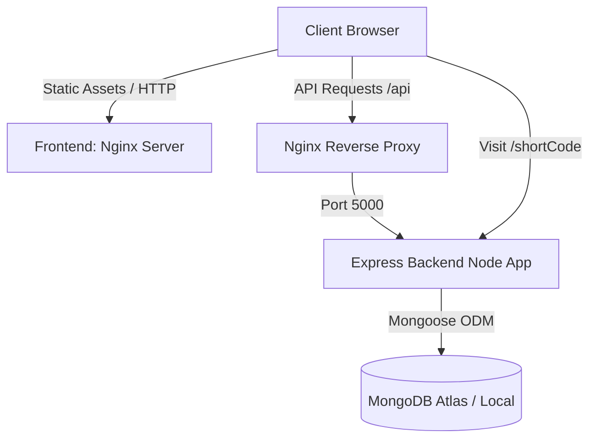
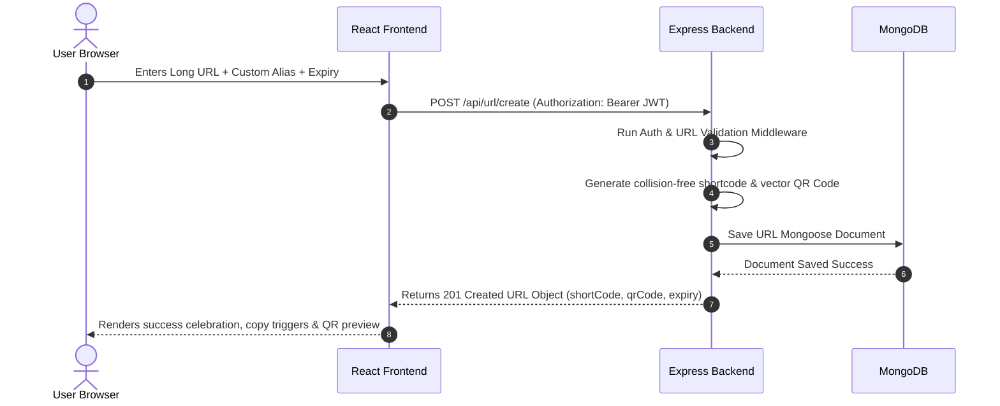
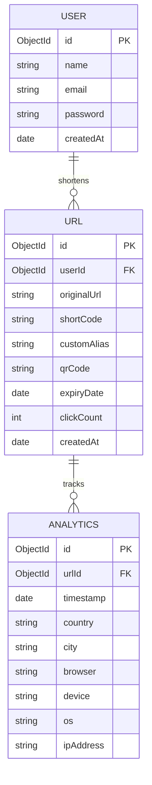

# SmartLink AI – Intelligent URL Shortener & Analytics Platform

SmartLink AI is a production-ready, full-stack URL shortener and analytics platform built for modern SaaS environments and marketing teams. The application simplifies link sharing by converting long, cluttered links into tiny branded codes, while capturing comprehensive traffic geographics, visitor browsers, device profiles, and operating systems. 

This platform features custom brand aliases, scheduled link expirations, vector/raster QR code creation, CSV bulk uploads, and an offline statistical AI insights service that summarizes traffic developments in clear English.

---

## CRUD / Link Lifecycle Diagram


---

## Architecture Diagrams

### 1. System Architecture


### 2. API Creation Sequence Flow


### 3. Database Entity Relationship Model


---

## Folder Structure

```
SmartLink AI/
├── backend/
│   ├── src/
│   │   ├── config/           # Database configuration connections (db.js)
│   │   ├── controllers/      # Route controllers (auth, urls, analytics)
│   │   ├── middleware/       # JWT protection & validator checks
│   │   ├── models/           # Mongoose Data models (User, Url, Analytics)
│   │   ├── routes/           # API router endpoints
│   │   └── services/         # Offline AI Insights engine (aiService.js)
│   ├── app.js                # Express app middleware bindings
│   ├── index.js              # Server boot entry script
│   ├── .env.example
│   └── Dockerfile
├── frontend/
│   ├── src/
│   │   ├── components/       # Reusable components (Charts, Tables, QR panels)
│   │   ├── context/          # React contexts (Auth, Themes, Toasts)
│   │   ├── hooks/            # theme controls
│   │   ├── pages/            # Frontend routes (Dashboard, Landing, Analytics)
│   │   ├── services/         # Axios wrapper client config (api.js)
│   │   ├── App.jsx           # Main router & routes wrapper
│   │   ├── index.css         # Styling with Tailwind CSS v4 directives
│   │   └── main.jsx          # React app entry mounter
│   ├── index.html
│   ├── vite.config.js
│   ├── nginx.conf            # Nginx server config with API reverse proxy
│   └── Dockerfile
├── docker-compose.yml        # Unified Multi-container runner file
└── README.md
```

---

## Environment Variables

### Backend Configuration (`backend/.env`)
Create a `.env` file inside the `backend` folder with:
```env
PORT=5000
MONGO_URI=mongodb://127.0.0.1:27017/smartlink
JWT_SECRET=super_secret_jwt_key_smartlink_ai_2026
JWT_EXPIRE=7d
FRONTEND_URL=http://localhost:5173
NODE_ENV=development
```

---

## Setup Instructions

### Option A: Local Setup (Node.js & MongoDB Local)

#### 1. Start MongoDB
Ensure MongoDB is running locally on port `27017`.

#### 2. Run Backend API
```bash
cd backend
# Install backend packages
npm install

# Start development server
npm run dev
```
The API should print `Server running on port 5000` and `MongoDB Connected`.

#### 3. Run Frontend Server
```bash
cd frontend
# Install packages
npm install

# Start Vite server
npm run dev
```
Visit `http://localhost:5173` inside your browser.

---

### Option B: Unified Docker Stack (Recommended)
Build and spin up the complete environment including MongoDB, Node API, and Nginx served Frontend with one command:

```bash
# In the root project folder
docker-compose up --build
```
Once initialized, go to `http://localhost:5173`. Nginx proxies requests to `/api/*` and redirects to container backends automatically.

---

## API Documentation

### Authentication Routes
*   `POST /api/auth/register` - Create user name, email, and password. Returns JWT.
*   `POST /api/auth/login` - Verify credentials. Returns JWT.
*   `GET /api/auth/me` - Get current session info (Protected).

### URL Routes
*   `POST /api/url/create` - Create short URL & QR Code (Protected). Supports aliases & expirations.
*   `POST /api/url/bulk` - Upload CSV list of URLs to shorten in a single batch (Protected).
*   `GET /api/url/all` - List current user links with search query, status filters, sorting, and pagination (Protected).
*   `GET /api/url/:id` - Fetch single link (Protected).
*   `PUT /api/url/:id` - Update targets or change expiration parameters (Protected).
*   `DELETE /api/url/:id` - Permanently remove URL and associated analytics logs (Protected).
*   `GET /api/url/stats/:shortCode` - Get public aggregate redirect stats (Public).

### Analytics Routes
*   `GET /api/analytics/:urlId` - Get detailed charts, trends, locations, browser/device pies, and AI insights for a URL (Protected).
*   `GET /api/analytics/user/summary` - Get aggregated stats counters and dashboard AI suggestions (Protected).

### Redirect Service
*   `GET /:shortCode` - Resolves code or custom alias, saves browser agent analytics, increments click counts, and performs a `302 redirect`. Gracefully serves responsive HTML notifications if code is not found or has expired.

---

## Deployment Guide

### Backend on Render
1. Create a Web Service on Render linking your GitHub repo.
2. Choose Environment `Node`. Set root directory to `backend`.
3. Build command: `npm install`.
4. Start command: `node index.js`.
5. Add Environment variables: `MONGO_URI` (pointing to your MongoDB Atlas cluster), `JWT_SECRET`, `NODE_ENV=production`.

### Frontend on Vercel
1. Create a Project on Vercel linking your GitHub repo.
2. Select Root directory to `frontend`.
3. Vercel automatically detects Vite. Set Build command to `npm run build` and output directory to `dist`.
4. Configure redirects inside `vercel.json` (or a proxy router) to direct `/api/*` requests to your Render backend API URL.

---

## Assumptions
- **Local IP Geographics**: When testing redirects on local intranet IPs (like `127.0.0.1` or `::1`), the analytics engine detects the local request and generates realistic simulated visitor geolocations (e.g., India/Bangalore, USA/New York) for a premium interactive demonstration.
- **AI Link Insights**: Category tags, safety/risk percentages, and SEO auditing reports are evaluated locally using a fast keyword and hostname rule-engine inside the backend service.
- **Link Health checking**: Health scans are triggered in the background during URL creation to minimize load latency, with standard axios requests tracking loops and status codes.
- **Security Protocols**: Standard cors allowances, express limits, and mongoose validations are in place to safeguard the REST API from injections.

---

## Future Improvements
- **Custom Domain Integration**: Allow enterprise clients to register custom vanity domains (e.g., `brand.co/slug`).
- **Webhooks**: Dispatch immediate JSON click payloads to arbitrary client endpoints on link click.
- **Detailed PDF Reports**: Generate styled printable analytical reports containing graph summaries.
- **Team Workspaces**: Collaborate inside shared folders and link portfolios.

---

## Loom Video Demo
*Replace this link with your Loom walk-through pitch:*
[Watch the Product Pitch & Technical Walkthrough](https://www.loom.com/share/28e1606cf1954446ad6c89cd4a9d3791)

---

This project is a part of a hackathon run by https://katomaran.com

